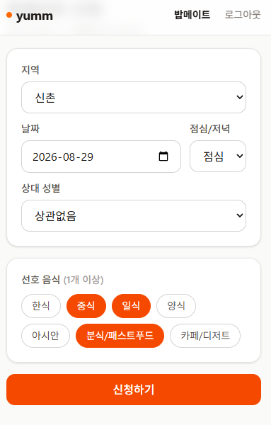
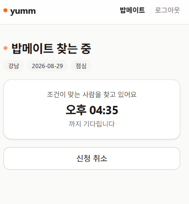
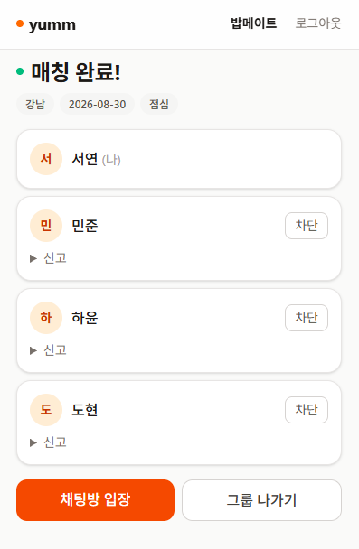
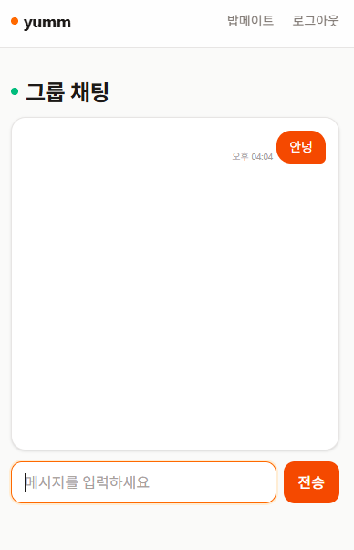

# yumm

**혼밥 대신 밥메이트.** 조건이 맞는 3~4인을 시스템이 자동으로 묶어 같이 밥 먹게 하는 매칭 서비스.

경쟁 상대는 데이팅 앱이 아니라 **오늘 혼자 먹게 될 그 한 끼**다.

| 신청 | 대기 | 매칭 완료 | 그룹 채팅 |
|---|---|---|---|
|  |  |  |  |
| 조건을 고르고 신청한다 | 30초 주기로 편성을 시도한다 | 3~4인이 묶이면 그룹이 생긴다 | 채팅방 입장이 곧 참석 의사 |

모바일 웹 전용이다. 네이티브 앱은 범위 밖(`requirements.md`).

---

## 왜 3~4인인가

이 숫자 하나가 설계 전체를 결정했다.

대화가 한 사람에게 몰리지 않는 최소 인원이 3명이고, 한 명이 못 나와도 밥자리가 유지되는 최소 인원도 3명이다. 2인은 "소개팅"으로 읽히고 노쇼 한 번에 만남이 0명이 된다. 5인 이상은 대화가 갈라진다.

그래서 `GroupMatcher.MIN_SIZE = 3`, `MAX_SIZE = 4`가 상수로 박혀 있고, **인원이 3명 밑으로 떨어진 그룹은 해체하고 남은 사람을 대기열로 되돌린다.** 매칭을 성사시키는 것보다 성사된 자리의 품질을 지키는 쪽을 택했다.

## 매칭이 도는 방식

```
신청 (POST /api/match)          →  저장만. 편성하지 않는다
        ↓
30초 주기 스케줄러                →  버킷별로 그리디 편성
        ↓
그룹 확정 (group_id 부여)         →  채팅방이 곧 그룹
        ↓
이탈 시 3인 미만이면 해체          →  남은 사람 대기열 복귀
```

- **버킷 = 지역 + 날짜 + 시간대.** 이 셋이 완전히 같은 사람끼리만 후보가 된다. 성별 조건은 상대에 따라 결과가 달라져서 버킷 키가 될 수 없고, 합류 시점에 쌍방으로 검사한다(`compatible()`). 차단 관계도 같은 자리에서 걸러낸다.
- **편성은 신청 API가 하지 않는다.** 신청은 저장만 하고 30초 주기 `@Scheduled`가 전담한다. 편성이 실패해도 신청이 롤백되지 않게 하려는 분리다.
- **그리디**다. 오래 기다린 사람을 씨앗으로 잡고 취향이 가장 많이 겹치는 사람을 붙인다. 전역 최적해 대신 "먼저 온 사람이 먼저"라는 공정성을 골랐다.
- **만료는 배치가 아니다.** 신청은 30분 뒤 만료되는데, 만료 상태를 저장하지 않고 조회 시각에 비교해서 계산한다. 만료 배치를 돌릴 이유가 없다.

설계 근거 전체는 [`docs/matching-design.md`](docs/matching-design.md).

## 직접 판단한 것들

포트폴리오로서 봐줬으면 하는 부분은 기능 개수가 아니라 아래의 트레이드오프다.

| 문제 | 선택 | 근거 |
|---|---|---|
| 같은 신청이 두 번 편성될 수 있다 | 편성 조회에 `PESSIMISTIC_WRITE` 락 | 스케줄러와 사용자 요청이 같은 행을 본다. 낙관적 락은 재시도 로직이 붙어 더 복잡해진다 (`MatchApplyConcurrencyTest`) |
| `@Scheduled`가 STOMP 브로커 스레드풀을 먹는다 | `SchedulingConfig`에 `taskScheduler` 빈 분리 | 편성이 길어지면 채팅 메시지 전달이 밀린다. 증상이 아니라 풀 공유가 원인이었다 |
| 그룹에 별도 테이블이 필요한가 | 안 만들었다. `match_requests.group_id` 컬럼 하나 | 그룹 자체에 속성(만날 시각·장소)이 생기는 시점이 엔티티로 승격할 시점이다. 지금은 없다 |
| 취향 매칭에 임베딩을 쓸까 | `yumm-inference`(FastAPI + FAISS)를 **삭제**했다 | 조건을 카테고리 선택으로 정하면서 호출부가 0곳이 됐다. 돌아가는 서비스가 3개라는 착시만 만들고 있었다. 카테고리만으로 부족하다는 지표가 나오면 되살린다 |
| 만 19세 미만을 어떻게 할까 | 차단. 연령 분리 없음 | 분리하면 버킷이 갈려 유동성이 반토막 난다. 얻는 유입은 사실상 0 |
| 나이를 어떻게 저장할까 | `age`가 아니라 `birth_year` | 나이는 시간이 지나면 틀린 값이 된다. 성인 판정의 근거라 더더욱 |

"무엇을 만들었나"보다 "무엇을 안 만들었나"를 [`docs/product-plan.md`](docs/product-plan.md) 9절에 결정 기록으로 남겼다.

## 기술 스택

| | |
|---|---|
| **서버** | Spring Boot 3.4.5 · Java 17 · JPA/Hibernate · PostgreSQL · Redis · Spring Security + JJWT · STOMP WebSocket · springdoc |
| **웹** | React 19 · TypeScript · Vite · Tailwind 4 · react-router-dom 7 |

- **Redis**는 JWT 리프레시 토큰과 로그아웃 블랙리스트에만 쓴다(`JwtRedisService`). 캐시 용도로 넣지 않았다.
- **채팅**은 Spring 내장 심플 브로커. 메시지를 서버 메모리에 들고 있어서 다중화하면 깨진다 — 스케일아웃 시 외부 브로커로 교체해야 하는 지점이고, 알면서 남겨둔 부채다.
- **DB 마이그레이션 도구를 쓰지 않는다.** `ddl-auto=update` + 필요 시 수동 DDL. 외부 공개 전까지는 도구 도입 비용이 이득보다 크다고 판단했고, 대신 [배포 전 실행할 SQL](docs/development.md#기존-db에-배포하기-전-수동-마이그레이션)을 문서로 고정해뒀다.

규모는 서버 약 3,800줄 / 웹 약 800줄, 엔드포인트 17개, 테스트 42개.

## 테스트

분기·루프가 있는 로직에는 테스트를 하나씩 남겼다. 프레임워크를 얹기보다 깨지면 잡히는 최소 단위를 노렸다.

| 테스트 | 무엇을 잡나 |
|---|---|
| `GroupMatcherTest` | 그리디 편성, 성별 쌍방 조건, 최소/최대 인원 |
| `MatchApplyConcurrencyTest` | 동시 신청 시 중복 편성 |
| `MatchSchedulerTest` | 주기 편성이 신규 신청 없이도 도는지 |
| `MatchLeaveGroupTest` | 이탈 후 3인 미만 해체와 대기열 복귀 |
| `MatchRequestReapplyTest` | 만료·취소 후 재신청 |
| `BlockDuplicateTest` | 차단 중복과 쌍방 배제 |
| `SignupBirthYearTest` / `SignupTermsAgreementTest` | 만 19세 판정, 약관 미동의 거부 |
| `StompAuthChannelInterceptorTest` | WebSocket 핸드셰이크 인증 |
| `ChatServiceTest` | 메시지 저장·조회 |

```bash
cd yumm-server && ./mvnw test
```

DB 없이 전부 통과한다. `DemoApplicationTests.contextLoads`만 PostgreSQL과 `JWT_SECRET`이 필요해서 둘 다 설정됐을 때만 켜진다 — [실행법](docs/development.md#빌드와-테스트).

## 현재 상태

개인 프로젝트이고 **아직 외부 공개 출시 전**이다. 낯선 사람과 대면하는 서비스라 안전 기능이 다 서기 전에는 열지 않기로 했다.

| 단계 | 내용 | 상태 |
|---|---|---|
| M0 | 인증/회원, 편성 로직, 그룹 채팅, 매칭 화면 | 완료 |
| M1 | 편성 스케줄러, 지역 enum, 서버 날짜 검증, 채팅 저장·조회 + 웹 채팅 화면 | 완료 |
| M2 | 매칭 후 이탈, 최소 인원 미달 시 그룹 해체 | 완료 |
| M3 | 매칭/해체 알림, 식사 당일 리마인드 | 스케줄러 분리만 완료 — 이메일 API 키 확보가 선행 조건 |
| M4 | 신고·차단·성인 인증·약관 동의·안전 수칙, 2인 폴백 | 진행 중 — 2인 폴백만 남음. 리마인드 알림(M3)이 선행 조건이라 M3 뒤로 밀린다 |
| M5 | 1개 지역 클로즈드 베타 | 예정 |

가장 큰 남은 과제는 **유동성**이다. 3~4인을 고집하는 이상 같은 지역·날짜·시간대에 최소 3명이 모여야 하고, 이게 이 서비스의 진짜 리스크다. 지역을 1~2곳으로 좁혀 여는 것, 조건이 안 맞을 때 2인까지 허용하는 폴백이 그에 대한 대비다.

## 문서

| 파일 | 내용 |
|---|---|
| [`docs/product-plan.md`](docs/product-plan.md) | 기획서. 문제 정의, 타깃, MVP 범위, 마일스톤, 결정 기록, 리스크 |
| [`docs/requirements.md`](docs/requirements.md) | 요구사항정의서. 기능별 ID·우선순위·구현 상태 |
| [`docs/matching-design.md`](docs/matching-design.md) | 매칭 설계 근거. 왜 이 알고리즘인지 |
| [`docs/development.md`](docs/development.md) | 로컬 실행, 환경변수, 배포 전 수동 마이그레이션 |

코드와 `docs/`가 어긋나면 임의로 맞추지 않고 먼저 확인한다. 기획의 단일 출처는 `docs/`다.
